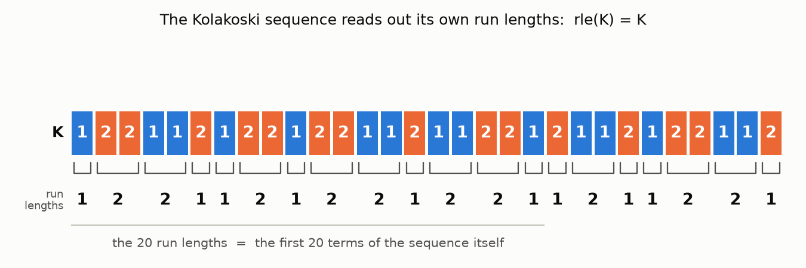
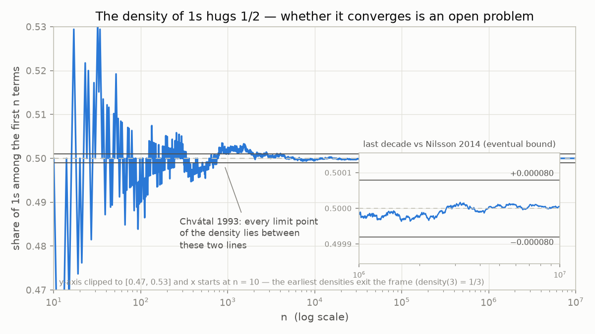
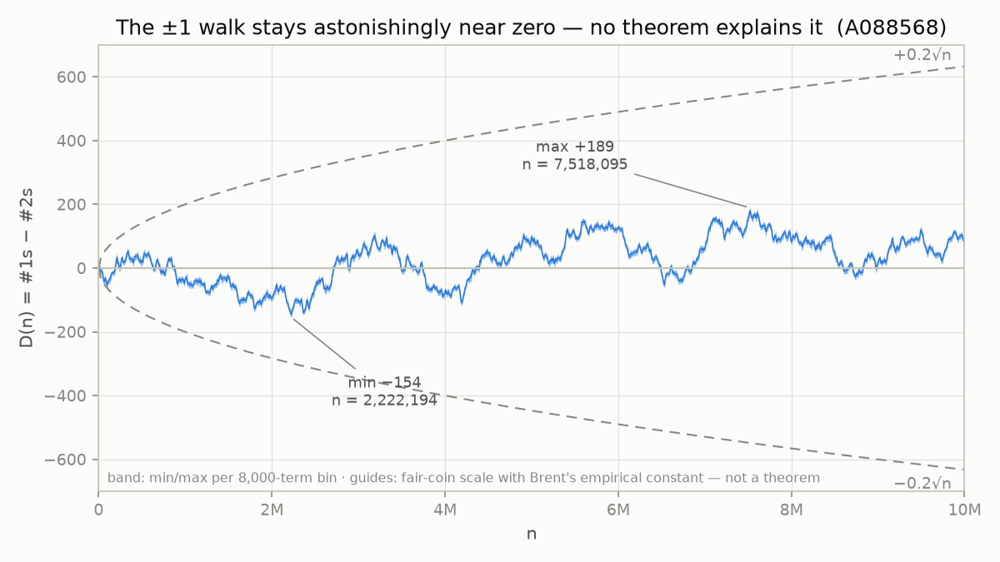
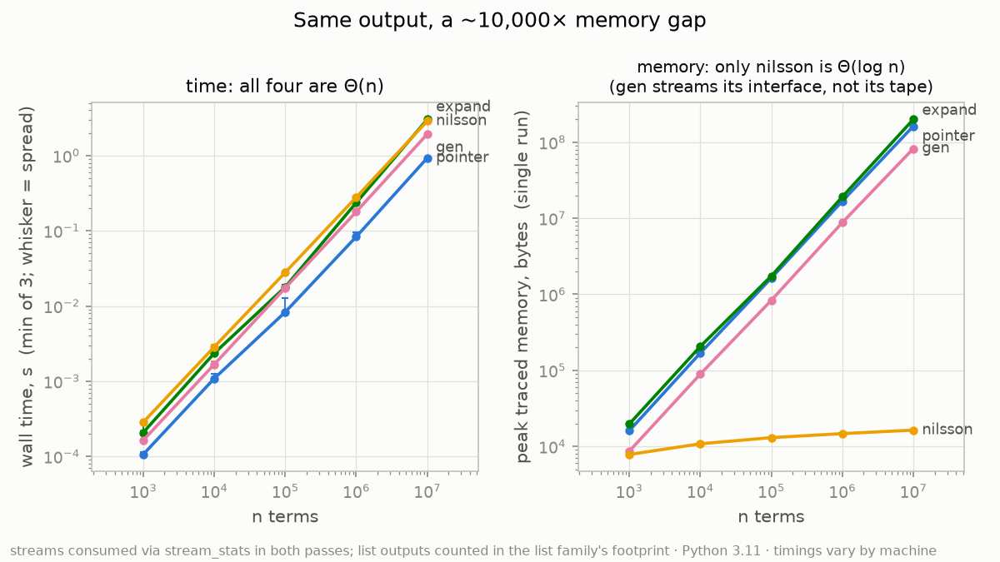
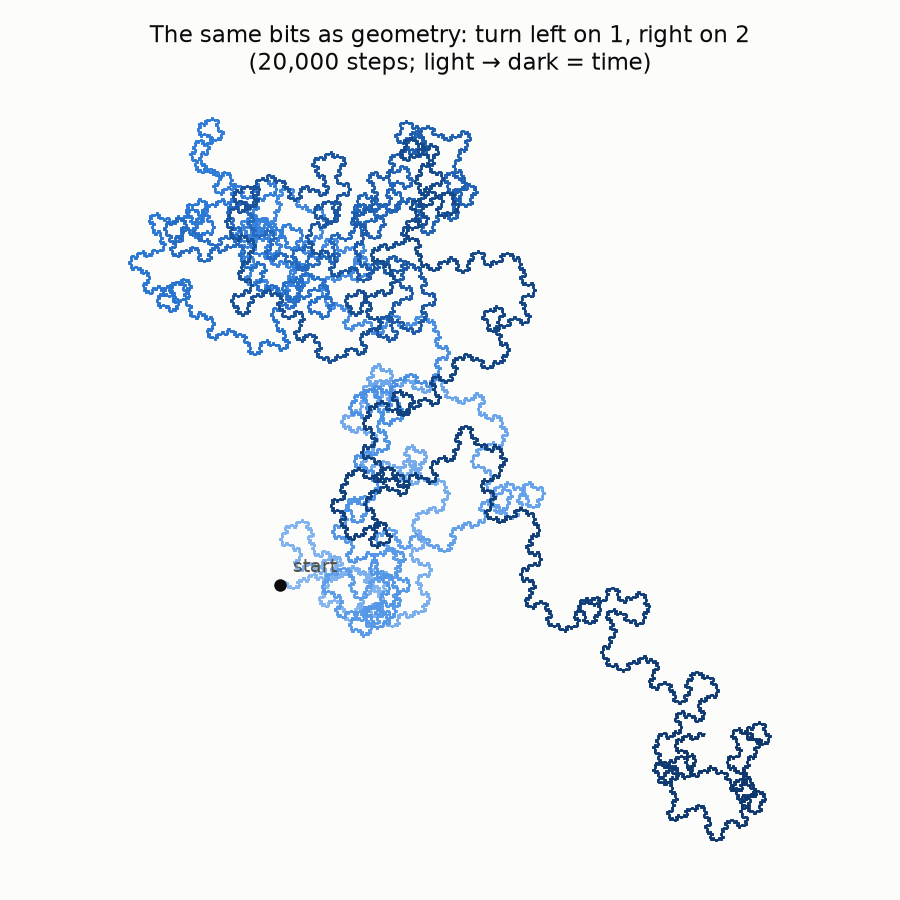
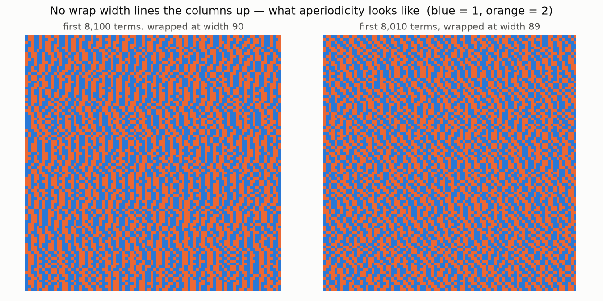

# The Sequence That Reads Itself Aloud

*A teaching writeup on the Kolakoski sequence — what is proven, what is measured,
and what nobody knows. Companion to the annotated code in
[`kolakoski.py`](../kolakoski.py) and the figures in [`figures/`](../figures).*

**How to read the claims here.** Following this repo's accuracy policy
([PLAN.md §3](../PLAN.md)): **verified** means *computed by code in this
repository* (you can re-run it); **known** means *cited to a source we checked,
first-hand unless marked otherwise*; and **open** means *nobody on Earth knows*.
The distinction is not pedantry — it is the subject of the lesson.

---

## 1. The hook

Write a sequence of 1s and 2s. Now chop it into *maximal runs* — blocks of equal
symbols — and write down each block's length. For almost any sequence you get
some unrelated new sequence. The Kolakoski sequence
([OEIS A000002](https://oeis.org/A000002)) is the one that gets *itself*:

The 20 run lengths along the bottom row are the first 20 terms of the top row.
This never stops being true: the sequence is a fixed point of the "describe your
runs" operation. That single sentence generates everything below — four
algorithms, six figures, a handful of two-line theorems, and one problem that
has embarrassed everyone since the 1960s.

## 2. The definition, twice — and why the two agree

**As a fixed point.** For an infinite word w over {1,2} that is not eventually
constant, let `rle(w)` be the sequence of its maximal-run lengths. (The domain
condition matters: an eventually-constant word ends in one infinite run, so
`rle` has nothing sensible to say about it. "Maximal" matters too — without it
the chopping is not unique: `1,2,2` also splits into blocks `(1)(2)(2)` with
lengths `1,1,1`.) **K is the unique infinite word starting with 1 such that
rle(K) = K.**

**Constructively.** K is what you get by *forcing*: it starts with 1, so its
first run has length 1, so the second symbol must be 2; that 2 says the second
run has length 2, so the third symbol is another 2; *that* 2 says the third run
has length 2, and runs alternate, so symbols four and five are 1,1; and so on.
Every symbol is forced by an earlier one, no choices ever arise —
`kolakoski_pointer` in [`kolakoski.py`](../kolakoski.py) is nothing but this
argument written as a loop, with the invariant `rld(seq[:i], 1) == seq`
(machine-checked in the test suite) as its certificate.

**Why the two agree.** The bridge is the decode operation `rld(lengths, first)`:
build the word whose maximal runs have the given lengths, symbols alternating
from `first` (alternation is forced — equal neighbors would merge). The two maps

    w  ⟼  (w₁, rle(w))            (s, ℓ)  ⟼  rld(ℓ, s)

are **mutually inverse bijections**: `rld(rle(w), w₁) = w` and
`rle(rld(ℓ, s)) = ℓ` for every length sequence ℓ (over positive integers) and
every word w in the domain. Carry the first symbol along and nothing is lost in
either direction. (Beware the tempting word "adjoint" — rle is not even
monotone for the prefix order: `rle(12) = 11` and `rle(122) = 12` are
prefix-incomparable. "Inverse pair" is the true statement. This wording was
itself a review correction — see `docs/reviews/round1-vidal.md`, minor 3.)

**The complete inventory of fixed points** (so "unique" is honest):

- Among *finite* words: exactly the empty word ε and the word `1`
  (Exercise T2 asks for the proof; it is three lines).
- Among infinite words: exactly two — K, and the sequence starting with 2,
  [A078880](https://oeis.org/A078880). The second is no stranger: **it is K
  with its first letter deleted.** Proof in one line: K's first run has length
  K₁ = 1, so deleting K's first letter deletes exactly its first run, whence
  `rle(shift K) = shift(rle K) = shift(K)`. **Verified:** A078880's b-file
  (10,000 terms) matches shift(K) term-for-term.

## 3. A short history

The word appears first in Rufus Oldenburger's 1939 study of symbolic dynamics
(*Trans. Amer. Math. Soc.* **46**, 453–466), as the "exponent trajectory" that
equals itself. It got its name from William Kolakoski, who posed it as Problem
5304 in the *American Mathematical Monthly* **72** (1965), p. 674 (solution:
Necdet Üçoluk, "Self Generating Runs," *Monthly* **73** (1966), 681–682). OEIS
keeps the name "Kolakoski sequence" while noting the Oldenburger precedence.
The density question that drives everything below is credited by Chvátal's
report to **Michael Keane**. (All bibliographic details verified against the
OEIS entry and the sources cited in §9.)

## 4. Easy theorems, honest proofs

**No `111` and no `222` (one line).** Every run length of K is a term of K,
and K's terms are 1s and 2s; a `111` would be a run of length ≥ 3. ∎

**Prefix sums are pinned to a window (two lines).** Since no three consecutive
symbols are equal, any 3 consecutive symbols contain at least one 2 and at
least one 1. Partition the first L positions into ⌊L/3⌋ disjoint triples (plus
leftovers): at least ⌊L/3⌋ of the first L terms are 2s, and at least ⌊L/3⌋ are
1s. Writing S(L) for the sum of the first L terms, S(L) = L + #2s(L), so

    L + ⌊L/3⌋  ≤  S(L)  ≤  2L − ⌊L/3⌋.

**Verified** to L = 10⁷ with zero violations, and near-tight on both sides.
Exercise T5 develops this into the growth analysis of `kolakoski_expand` — and
into the punchline that improving the window's ratio to 3/2 *is* the open
problem. (The bound this replaced — a v1 claim refuted at L = 257 by both
reviewers independently — is preserved in Exercise T4's sibling story; see
`docs/reviews/round1-okafor.md` major 1.)

**Inverting the window (run counts).** If R(L) is the number of maximal runs
among the first L symbols, the same window read backwards gives

    ⌈(3L−2)/5⌉  ≤  R(L)  ≤  ⌈3L/4⌉,

because the first R runs of K have total length S(R) (self-description!), and
S is pinned by the window above. **Verified** to L = 10⁷; both reviewers
derived this independently in round 2, and it now guards the test suite
against a degenerate `rle` (an identity function fails it at every L ≥ 4).

**K is not eventually periodic.** This one is *elementary but not one line* —
the plan's first draft carried a gapped sketch of it, and finding those gaps is
now Exercise T4. Here is the full argument.

> **Theorem.** K is not eventually periodic.
>
> **Proof.** Suppose it were, and let p ≥ 1 be the **minimal eventual period**:
> the least p such that, beyond some preperiod, K_{i+p} = K_i for all i.
>
> *Step 1 — the tail is not constant.* A constant tail is a single infinite
> run, impossible since every run of K has length ≤ 2. So p ≥ 2.
>
> *Step 2 — run boundaries repeat with the period.* Deep in the tail (past the
> preperiod plus one), position i starts a run exactly when K_i ≠ K_{i−1};
> both symbols repeat with period p, so i + p starts a run whenever i does.
> Pick a run-start b₀ deep in the tail. The block K_{b₀} … K_{b₀+p−1} then
> begins at a run boundary and its run decomposition repeats verbatim forever.
> Let r be the number of runs in that block, so p is the sum of their lengths.
>
> *Step 3 — some run in the block has length 2.* Otherwise every run in the
> tail has length 1, i.e. the tail is …121212… ; but then the run-length
> sequence of K has a tail of all 1s, and rle(K) = K would make *K's own tail*
> constant — contradicting Step 1.
>
> *Step 4 — the descent.* By Step 3, p (a sum of r lengths from {1,2}, at
> least one being 2) satisfies p ≥ r + 1 > r. Now apply rle: from the b₀-run
> onward, the run lengths of K repeat with period r, so rle(K) is eventually
> periodic with period r. But rle(K) = K, so K is eventually r-periodic with
> r < p — contradicting the minimality of p. ∎

The three load-bearing details — *minimal* eventual period, run-boundary
alignment, and the exclusion of the all-1-runs tail — are exactly the three
gaps in the draft version. That a plausible sketch can be wrong in three
distinct ways is the real lesson; the review trail shows it happening.

## 5. The open problem

Here is everything unknown, stated precisely. Let o(n) be the number of 1s
among the first n terms, and d(n) = o(n)/n.

> **Open (Keane's question).** Does lim d(n) exist? If it exists, is it 1/2?

Not just the value — **even the existence of the limit is unproven.** What *is*
known is a shrinking cage of rigorous bounds:

| Year | Result | Status in this repo |
|---|---|---|
| 1993 | Chvátal (DIMACS TR 93-84): every limit point of d(n) — and of the 2s' density — is **below 0.501** (hence every limit point lies in (0.499, 0.501)). | **known**, abstract read first-hand. The widely quoted finer digits 0.500838/0.499162 are in the report's body, which sits behind a dead FTP link — we could not read it, so those digits are **known (second-hand)** via Wikipedia, and we do not put them on ink. |
| 2008 | Kupin–Rowland (arXiv:0809.2776): \|freq₁(K) − 1/2\| ≤ **17/762** ≈ 0.0223, ***assuming the limit exists***; and a "semi-rigorous" *unconditional* 1/46 ≈ 0.0217. | **known**, abstract quoted first-hand. A miniature lesson in reading hedges: rigorous-but-conditional and unconditional-but-semi-rigorous are different currencies. |
| 2014 | Nilsson (*Acta Phys. Pol. A* **126**, 549–552): there is an N ≥ 1 with sup over n ≥ N of \|d(n) − 1/2\| ≤ **455920839/911696379 − 1/2 ≤ 0.000080** — two-sided, and explicitly *not* assuming the frequency exists. N is not made effective. | **known**, PDF read first-hand. The best rigorous bound we could locate. |

And what our own code sees (**verified**, all re-runnable):

- d(10⁶) = **0.499986** but d(10⁷) = **0.5000046** — the deviation *changes
  sign*. Convergence, if it is happening, is not monotone.
- The largest deviation \|d(n) − 1/2\| for n in (10⁶, 10⁷] is
  **3.892106×10⁻⁵ at n = 1,798,512** (exactly 70/1,798,512) — matching the
  decade entry 3.892×10⁻⁵ in Nilsson's own Table I to every digit the paper
  prints. Two independent programs, twelve years apart, in exact agreement:
  that is what *verified* buys you, and it still proves nothing about the
  limit. (In fig2, note the y-axis is clipped to [0.47, 0.53] — the very
  earliest densities, like d(3) = 1/3, exit the frame; the figure says so
  on-ink.)

The discrepancy walk D(n) = #1s − #2s (= [A088568](https://oeis.org/A088568);
the identity is exact algebra: A088568 is defined as 3n − 2S(n), and
3n − 2S(n) = n − 2·#2s = D(n)) makes the same mystery kinetic:

**Verified:** over the first 10⁷ steps the walk peaks at +189 (n = 7,518,095)
and dips to −154 (n = 2,222,194). A fair coin would wander to ±√10⁷ ≈ ±3162.
**Known:** at n = 2⁶⁴, Brent reports \|D\| = 836,086,974 ≈ 0.19·√(2⁶⁴), and
judges the once-conjectured O(log n) growth "seems incorrect" (OEIS A088568
comment / A289323). So the √n *shape* looks right with a startlingly small
constant — and none of it is a theorem. The dashed ±0.2√n guides in the figure
are that empirical statement, not a mathematical one.

## 6. Four algorithms, annotated

The full annotations live in [`kolakoski.py`](../kolakoski.py); this section is
the guided tour. All four produce identical output (the test suite checks them
against each other, against a 300-term OEIS transcription, and against the
structural theorems of §4 — three oracle families with no shared failure mode).

**A. The self-reading tape** (`kolakoski_pointer`). The forcing argument as a
loop: a read pointer trails the write end, `seq[i]` dictates the next run.
The invariant `rld(seq[:i], 1) == seq` — "the lengths consumed so far, decoded,
rebuild the tape exactly" — is established by the seed (`rld([1,2],1) =
[1,2,2]`) and preserved by each step. *The plan's first draft stated a
plausible-looking invariant that is false at loop entry;* review caught it,
and the corrected one is machine-checked in the tests. O(n) time, O(n) memory.

**B. Iterated decoding** (`kolakoski_expand`). K is the limit of
`[1,2] → rld → rld → ⋯`. The engine is the

> **Decode-prefix lemma.** If w is a prefix of K with L = len(w), then
> rld(w, 1) is again a prefix of K, of length S(L). *Proof:* rle(K) = K says
> K's j-th maximal run has length K_j; runs alternate symbols starting from
> K₁ = 1. So rld(w, 1) — runs of lengths K₁…K_L, alternating from 1 — *is*
> the concatenation of K's first L runs, a prefix of K of length
> K₁ + ⋯ + K_L = S(L). ∎

By §4's window, each pass multiplies the length by a factor between roughly
4/3 and 5/3, so Θ(log n) passes suffice — **with no unproven input**. The
empirical factor drifts toward 3/2, but *proving* 3/2 is equivalent to the
open problem (Exercise T5c): an algorithm analysis that quietly assumed it
would be circular, which is precisely the mistake the plan's v1 made and the
reviewers refuted at L = 257. Measured: 33 passes to clear 10⁶, 39 to clear
10⁷. One more trap for the reader: the seed must be `[1,2]`, because the word
`[1]` is itself a fixed point of decoding — start there and the iteration
never moves.

**C. The honest generator** (`kolakoski_gen`). Method A behind an iterator
interface. The interface streams; the memory does not — the tape is retained
because the pointer will need it. O(n) memory, stated plainly. It exists to
make D's achievement legible.

**D. The chain of levels** (`kolakoski_nilsson`). The tape in A is only ever
*reread as run lengths* — and the run lengths of K are K. So replace the
stored tape with a second, lazier instance of the same generator, which
consults a third, and so on. Each level hardcodes its first two runs (symbols
1,2,2), then reads further run lengths from its parent, discarding the
parent's first two symbols (already spent). A level advances its parent one
symbol per run it emits — a rate eventually in [3/5, 3/4] (the exact
finite-L statement is §4's run-count window; at L = 1 the ratio is 1) — so
after n terms only Θ(log n) levels exist. **Verified:** 39 levels
after 10⁷ terms, and the whole chain fits in ~16 KB while the tape-based
methods hold ~10⁸ bytes. This is the construction behind Nilsson's 2012
algorithm ("logarithmic space and still runs in linear time," *J. Integer
Seq.* 15, art. 12.6.7) — the machinery his 2014 density computations run on.

*Look for:* the right panel's flat orange line. Also the pink `gen` line in
the same panel — a streaming *interface* over Θ(n) *memory*. Interfaces make
promises; only algorithms keep them.

## 7. The rest of the gallery

**fig4 — the bits as geometry.** Turn left on 1, right on 2, step forward;
20,000 steps, light → dark with time. Purely qualitative — no theorem is
illustrated — but notice how the path neither settles into a lattice orbit
(which periodicity would force) nor diffuses like a coin-flip walk. It
meanders with long-range hesitation, which is exactly the texture of a
sequence whose statistics nobody can pin down. *Look for:* places where the
path nearly retraces itself for a while, then escapes.

**fig5 — aperiodicity you can squint at.** Nearly the same prefix — 8,100
terms in the left panel, 8,010 in the right, so each panel fills its
rectangle exactly — wrapped at widths 90 and 89. If K were eventually periodic with period p, any wrap width that is
a multiple of p would eventually organize into vertical stripes — and near
misses would show diagonal banding. Neither width (nor any other you will try;
Exercise C3) produces alignment. This is *evidence*, and §4's theorem is the
*proof* — the figure's job is to make you want one. *Look for:* short-lived
vertical motifs that dissolve after a few rows: the ghost of "almost periodic,
never periodic."

## 8. Exercises

Difficulty: ●○○ warm-up · ●●○ engaged · ●●● project.

**Computational.**

- **C1 (●●○).** Compute the density of 1s at n = 10⁸ without storing 10⁸
  terms, using `kolakoski_nilsson` + `stream_stats`. (Our measured d(10⁶),
  d(10⁷) are in §5 — extend the table one decade. Does the sign flip again?)
- **C2 (●●○).** The walk D(n) returns to 0 infinitely often as far as anyone
  has looked. Tabulate the gaps between consecutive zeros up to 10⁷. What is
  the longest gap? Where does it start?
- **C3 (●○○).** Add a third wrap width to fig5 (edit `viz.py`). Try widths
  near multiples of small numbers — why do you *still* see no stripes?
- **C4 (●●○) — break the generator, then catch it.** Three sabotaged pointer
  variants: (a) seed `[1,2]` with read pointer starting at i = 1; (b) seed
  `[1,2,2]` with i = 1; (c) the writer's starting symbol flipped to 2.
  *Predict* which test in `tests/test_kolakoski.py` catches each mutant and at
  which index its output first differs from K; then check. (Answers, verified:
  divergence at indices 2, 6, 3.) Map each oracle's blind spots: which mutant
  would survive if only the structural tests existed? This exercise is why the
  suite pins `rle` with hand vectors — an identity `rle` satisfies the
  fixed-point test perfectly (review round 1, Okafor major 4).

**Theoretical.**

- **T1 (●○○).** Write out §4's no-`111` argument in your own words, then
  prove the sharper statement used by T5: any 3 consecutive symbols contain
  both a 1 and a 2.
- **T2 (●○○).** Prove the finite fixed-point inventory: rle(w) = w for a
  finite word w over {1,2} iff w = ε or w = `1`.
- **T3 (●●○).** Prove the decode-prefix lemma (§6B) carefully, including why
  the symbol alternation matches K's own runs.
- **T4 (●●○) — referee training.** The plan's first draft "proved"
  non-periodicity with this sketch: *"if K were eventually periodic with
  period p, applying the run-length derivative maps period sums → strictly
  shorter period (average run length > 1), contradicting rle(K) = K."*
  Identify the gaps (there are at least three — §4's proof names them),
  repair each, and check your repairs against the full proof. Extra credit
  for legitimate gaps beyond the canonical three (why, for instance, may the
  period block be assumed to start at a run boundary *in every copy*?). The
  original sketch and its demolition are preserved verbatim in
  `docs/reviews/round1-vidal.md`, major 3.
- **T5 (●●○) — provable bounds, and what 3/2 would cost.** (a) From T1,
  derive ⌊L/3⌋ ≤ #2s(L) ≤ L − ⌊L/3⌋ and hence §4's window on S(L).
  (b) Deduce that the expand iteration's lengths satisfy
  L_{k+1} ≥ (4L_k − 2)/3, and conclude L_k ≥ 2 + (4/3)^{k−2} for k ≥ 2
  (tight at k = 2 — and mind the exponent: the k−1 version fails at k = 1, 2,
  an off-by-one a reviewer caught in her own round-1 sketch). So Θ(log n)
  rounds, unconditionally. (c) Show that "S(L)/L → 3/2" is *equivalent* to
  Keane's question. Moral: the difference between a [4/3, 5/3] window and a
  3/2 limit is the difference between an afternoon and sixty years.

**Extension.**

- **X1 (●●●) — Kolakoski-(3,1).** Replace the alphabet {1,2} by {1,3} (runs
  of length 1 or 3, symbols still alternating; the classical object starts
  with 3). Implement it, plot its running letter frequency next to Kol(1,2)'s.
  You will find it converges visibly — and *there* it is a theorem: the
  (3,1) sequence is generated by a **primitive substitution** (Baake–Sing
  2002, "Kolakoski-(3,1) is a (deformed) model set"), and primitive
  substitutions have uniformly existing letter frequencies, computable from
  the Perron–Frobenius eigenvector of the substitution matrix (see e.g.
  Allouche–Shallit, *Automatic Sequences*, ch. 8, or Dekking's 1997 survey
  for the Kolakoski context). Compute the predicted frequency from the
  eigenvector and compare with your measurement. Then sit with the irony:
  add self-similarity and the "hard" question falls; the original {1,2} case
  has no such structure that anyone can find.

## 9. References

Tags: **[F]** read first-hand for this repo · **[O]** bibliographic data and/or
quoted claim taken from the OEIS entry · **[S]** second-hand, as marked ·
**[P]** pointer for further reading (not relied on for any claim here).

1. **[F]** OEIS Foundation, [A000002](https://oeis.org/A000002) and its
   b-file (10,502 terms; all verified against this repo's generators,
   2026-07-19 — re-run via `tools/crosscheck_oeis.py`). Also
   [A078880](https://oeis.org/A078880) (verified = shift(K), 10,000 terms),
   [A088568](https://oeis.org/A088568), [A289323](https://oeis.org/A289323)
   (Brent's growth comments quoted from the entries).
2. **[O]** R. Oldenburger, "Exponent trajectories in symbolic dynamics,"
   *Trans. Amer. Math. Soc.* **46** (1939), 453–466.
3. **[O]** W. Kolakoski, Problem 5304, *Amer. Math. Monthly* **72** (1965),
   674; solution: N. Üçoluk, "Self Generating Runs," **73** (1966), 681–682.
4. **[F]** V. Chvátal, "Notes on the Kolakoski Sequence," DIMACS Technical
   Report 93-84 (1993). Abstract read first-hand (both upper densities
   < 0.501; the question credited to M. Keane). Body unavailable (dead FTP
   link, attempted 2026-07-19); the finer digits 0.500838/0.499162 are **[S]**
   via the Wikipedia article.
5. **[F]** J. Nilsson, "A Space Efficient Algorithm for the Calculation of
   the Digit Distribution in the Kolakoski Sequence," *J. Integer Sequences*
   **15** (2012), art. 12.6.7 (abstract quoted; also arXiv:1110.4228).
6. **[F]** J. Nilsson, "Letter Frequencies in the Kolakoski Sequence," *Acta
   Physica Polonica A* **126** (2014), 549–552. PDF read first-hand; the
   sup-bound display and Table I quoted in §5.
7. **[F]** E. J. Kupin and E. S. Rowland, "Bounds on the frequency of 1 in
   the Kolakoski word," arXiv:0809.2776 (2008). Abstract quoted.
8. **[O]** A. Carpi, "On repeated factors in C∞-words," *Inform. Process.
   Lett.* **52** (1994), 289–294 — cube-freeness and square lengths
   {2,4,6,18,54}, as summarized in the A000002 comments; corroborated in-repo
   over the first 20,000 terms (square half-lengths found: exactly
   {1,2,3,9,27}, no cubes).
9. **[F]** M. Baake and B. Sing, "Kolakoski-(3,1) is a (deformed) model set,"
   arXiv:math/0206098 (2002; *Canad. Math. Bull.* **47** (2004)). Abstract
   read: primitive-substitution connection, model-set structure, pure point
   diffraction.
10. **[P]** F. M. Dekking, "What is the long range order in the Kolakoski
    sequence?", in *The Mathematics of Long-Range Aperiodic Order* (1997),
    115–125.
11. **[P]** J.-P. Allouche and J. Shallit, *Automatic Sequences*, Cambridge
    Univ. Press (2003) — the standard reference for substitution systems and
    letter frequencies (cited as a book; no specific theorem number is relied
    on here).
12. **[S]** Wikipedia, "Kolakoski sequence" (fetched 2026-07-19) — used only
    where marked, and never as the sole source for a number on ink.

---

*This document was built under review: two AI reviewer personas (disclosed in
`docs/reviews/`) attacked the plan that specified it, refuted one of its
lemmas, corrected its author's response tables, and in one case corrected
themselves. The full trail — including everything that was wrong before it
was right — ships with the repo, because the trail is the curriculum.*
